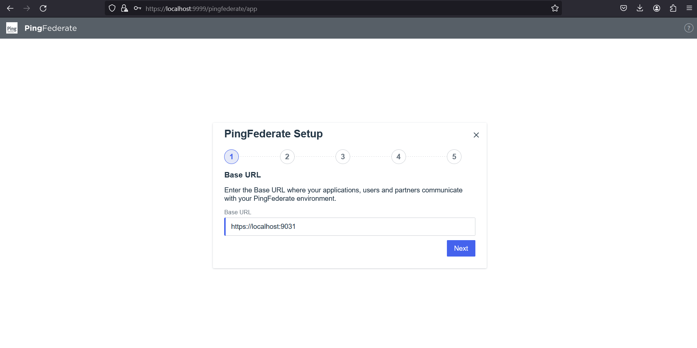

## SET UP GUIDE

### Open in Browser
Please open ***Mozilla Firefox*** or Chrome browser
 - After basic installation, go to the url in the browser:
    ```bash
        https://localhost:9999/
    ```
 - make sure to proceed unsafe and accept the risk as this app is using a self-signed certificate.

### Steps
Please follow the Steps:
 - 
 - 
 - 
 - 
 - 